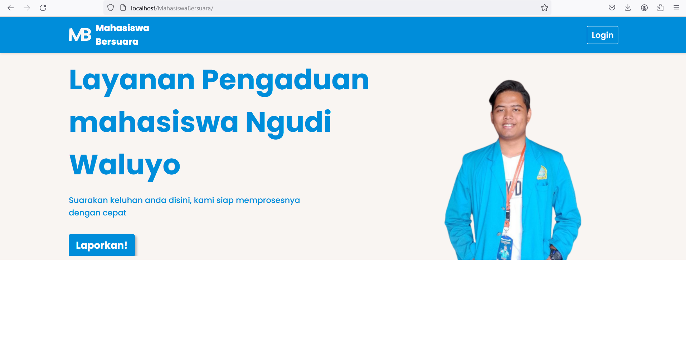
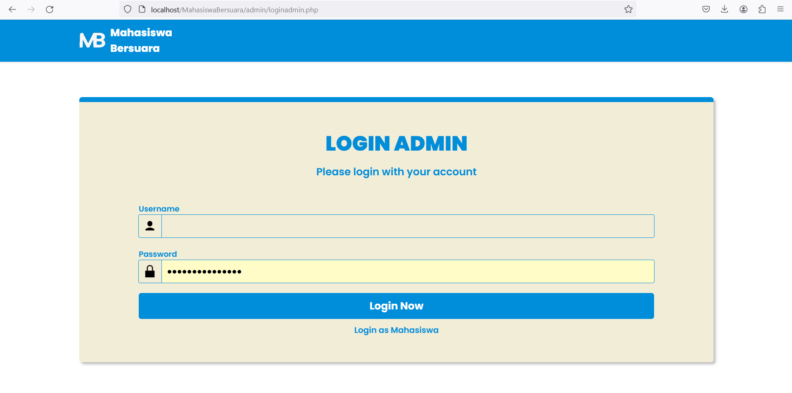
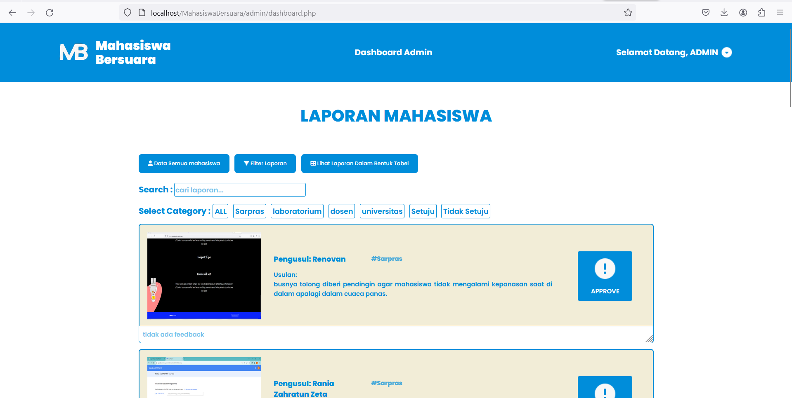
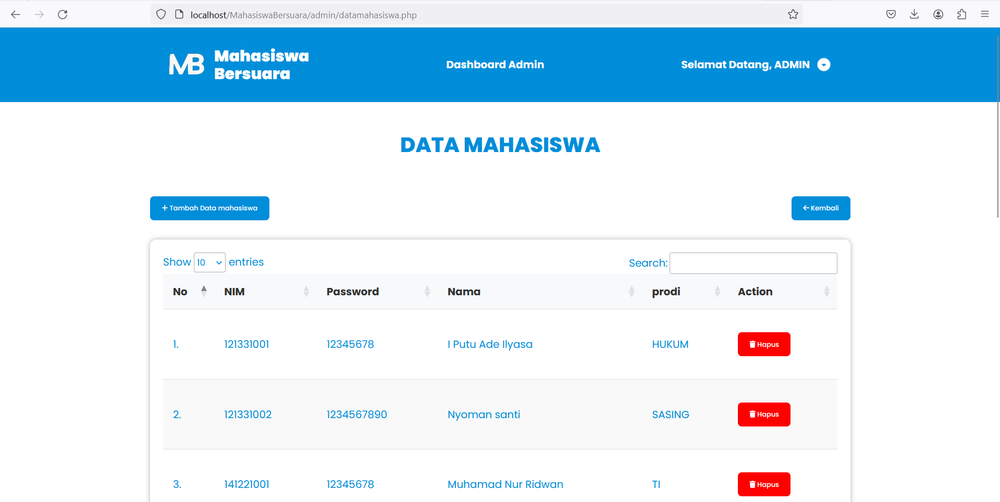
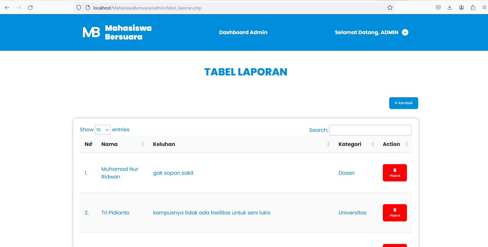
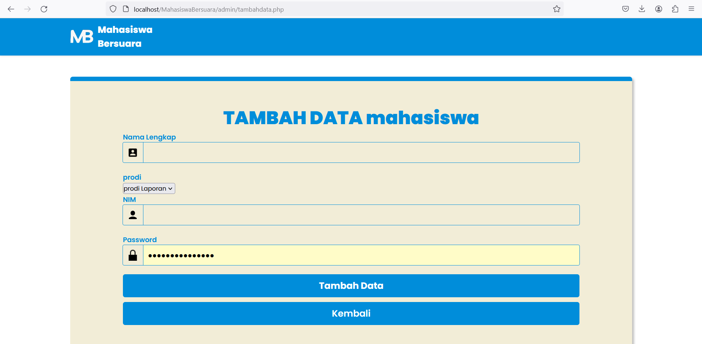
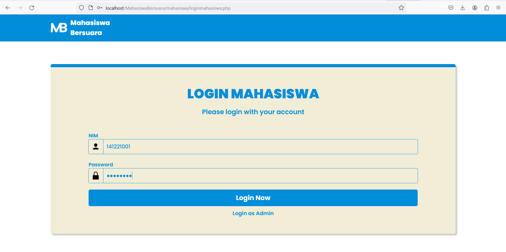
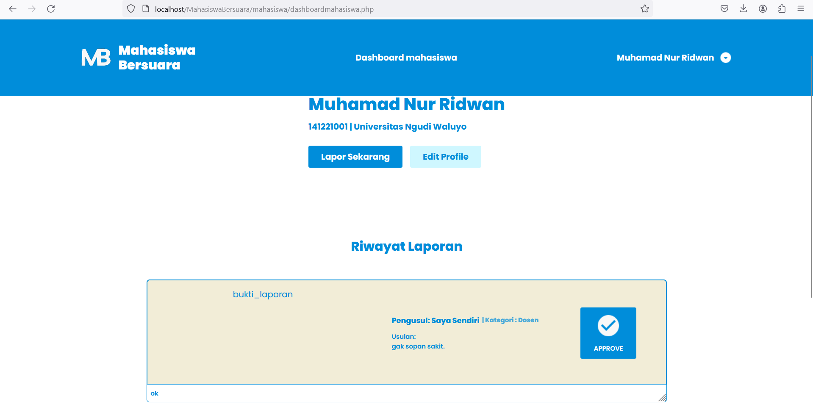
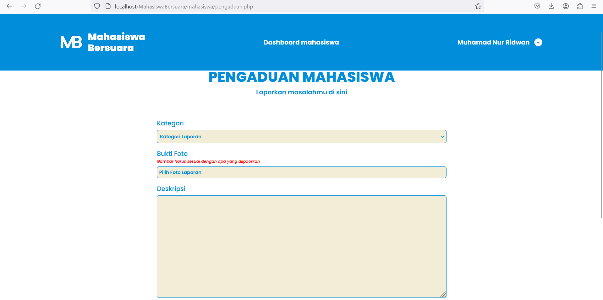
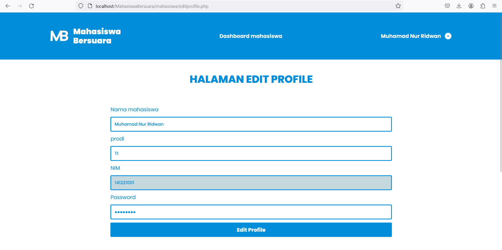

# Mahasiswa Bersuara Universitas Ngudi Waluyo
<h4>Nama Project ini adalah : Mahasiswa Bersuara</h4>
 

 

dimaan projek ini bertujuan agar mahasiswa dapat menyuarakan aspirasi mereka dengan lebih mudah dan cepat

 

website ini dibuat menggunakan HTML, CSS,  bootstrap, javascript, php dan database mysql.

Fitur fitur yang terdapat didalam aplikasi ini : 
<ul>
<li>Memiliki 2 akses login, admin dan user/mahasiswa .</li>
<li>Akses sebagai admin mendapatkan fasilitas berupa : Mnyetujui atau menolak sran dari mahasiswa dengan memberi deskripsi, update, delete dan creat mahasiswa baru.</li>
<li>Akses sebagai mahasiswa mendapatkan fasilitas berupa : melaporkan dan mengedit data profile</li>
</ul>

# Berikut adalah tampilan dari website saya

<h3>Halaman Awal</h3>

 
<h2>Tampilan Admin</h2>
 
<h3>Halaman Login Admin</h3>

 
<h3>Halaman Dashboard Admin</h3>

 
<h3>Halaman Data Mahasiswa</h3>

 
<h3>Halaman Tabel Laporan</h3>

 
<h3>Halaman Creat Mahasiswa</h3>

 
<h2>Tampilan User</h2>
 
<h3>Halaman LogIn Mahasiswa</h3>

 
<h3>Halaman Dashboard</h3>

 
<h3>Halaman Pengaduan</h3>

 
<h3>Halaman Edit Profile</h3>

